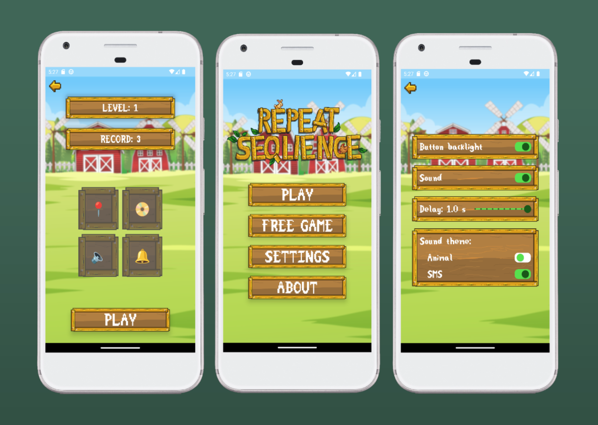

# **Android Simon Says Game Compose**

It's a game similar to Simon Says. 
You need to repeat a sequence of sounds. With each successful level, the length of the sequence increases. If you make a mistake, the game ends.

## **Screenshots**

## **Features**

The interface and logic of the game has been implemented. 
There is also the possibility of free play, where there is no set sequence.
In the settings you can enable/disable animation of clicks during the game, enable/disable sound, set a delay between sounds when playing a sequence of sounds, and set a different sound theme.

## **Stack**

    &nbsp;
    &nbsp;
    &nbsp;
    &nbsp;
    

